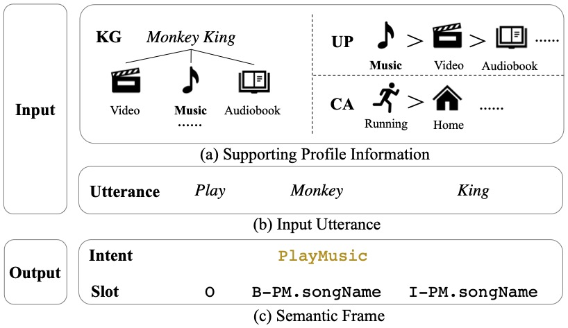
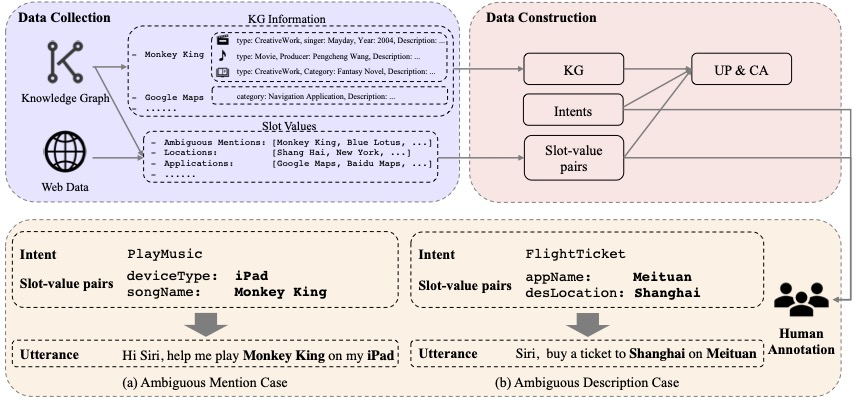
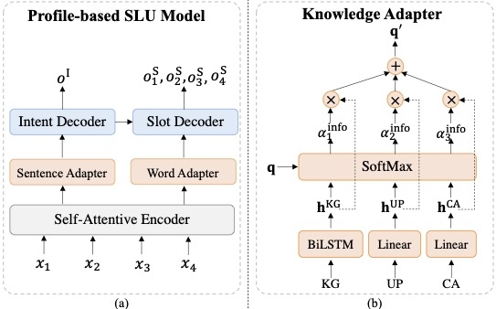
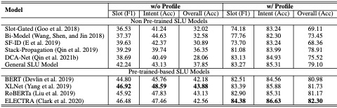

# Text is no more Enough! A Benchmark for Profile-based Spoken Language Understanding

This repository contains the official `PyTorch` implementation of the paper: 

**Text is no more Enough! A Benchmark for Profile-based Spoken Language Understanding**. [Xiao Xu*](http://ir.hit.edu.cn/~xxu/), [Libo Qin*](http://ir.hit.edu.cn/~lbqin/), Kaiji Chen, Guoxing Wu, Linlin Li, [Wanxiang Che](http://ir.hit.edu.cn/~car/). ***AAAI 2022***. [[Paper(Arxiv)]]() [[Paper]]()

If you use any source codes or the datasets included in this toolkit in your work, please cite the following paper. The bibtex are listed below:

<pre>
...
</pre>


In the following, we will guide you how to use this repository step by step.

## Workflow


## Architecture


## Results


## Preparation

Our code is based on the following packages:

- numpy==1.19.5
- tqdm==4.50.2
- pytorch==1.7.0
- python==3.7.3
- cudatoolkit==11.0.3
- transformers==4.1.1

We highly suggest you using [Anaconda](https://www.anaconda.com/) to manage your python environment.

We download the chinese pretrained model checkpoints from the following links:
- [BERT & RoBERTa](https://github.com/ymcui/Chinese-BERT-wwm)
- [XLNet](https://github.com/ymcui/Chinese-XLNet)
  - [Huggingface chinese-xlnet-base](https://huggingface.co/hfl/chinese-xlnet-base/)
- [ELECTRA](https://github.com/ymcui/Chinese-ELECTRA) 
  - [Huggingface chinese-electra-180g-base-discriminator](https://huggingface.co/hfl/chinese-electra-180g-base-discriminator/)
  - [Huggingface chinese-electra-180g-base-generator](https://huggingface.co/hfl/chinese-electra-180g-base-generator/)

## How to Run it

The script **train.py** acts as a main function to the project, you can run the experiments by the following commands.

```Shell
# LSTM w/o Profile on titan_xp
python train.py -g -fs -es -uf -bs 8 -lr 0.0006
# LSTM w/ Profile on titan_xp
python train.py -g -fs -es -uf -ui -bs 8 -lr 0.0004
# BERT w/o Profile on tesla_v100-pcie-32gb
python train.py -g -fs -es -uf -up -mt XLNet -bs 8 -lr 0.001 -blr 4e-05
# BERT w/ Profile on Tesla V100 PCIE 32GB
python train.py -g -fs -es -uf -up -ui -mt ELECTRA -bs 8 -lr 0.0008 -blr 4e-05
```

If you have any question, please issue the project or email [me](mailto:xxu@ir.hit.edu.cn) or [lbqin](mailto:lbqin@ir.hit.edu.cn), and we will reply you soon.

## Acknowledgement
- We are highly grateful for the public code of Stack-Propagation!
  > A Stack-Propagation Framework with Token-Level Intent Detection for Spoken Language Understanding. Libo Qin,Wanxiang Che, Yangming Li, Haoyang Wen and Ting Liu. *(EMNLP 2019)*. Long paper. [[pdf]](https://www.aclweb.org/anthology/D19-1214/) [[code]](https://github.com/LeePleased/StackPropagation-SLU)
- We are highly grateful for the open-source knowledge graph!
  - [CN-DBpedia](http://kw.fudan.edu.cn/apis/cndbpedia/)
  - [OwnThink](https://www.ownthink.com/docs/kg/)